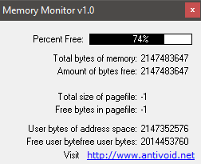

# Memory Monitor

### About:
Displays the amount of free memory, and some other memory metrics.

### Instructions:
Run the .exe to view your free memory available.

### Screenshot:

### Info:
**Created:** 2006

**Operating System:** Windows 2000 or newer

**Compile with:** Borland C++ Builder 6
